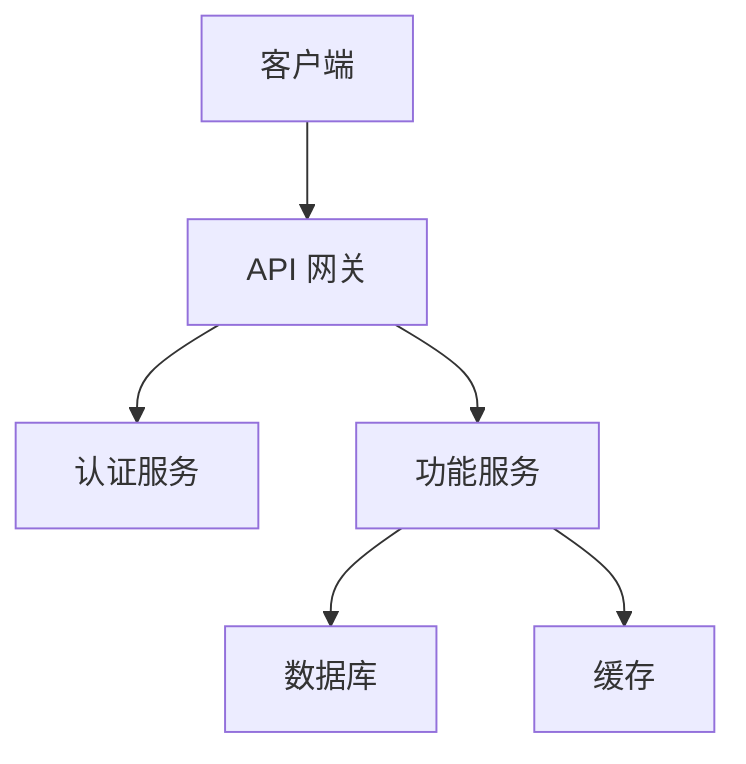

# 设计文档 (Design Documentation)

创建连接需求与实施的技术蓝图。此技能教授如何记录架构决策、组件设计和系统交互。

## 何时使用此技能

在以下情况下使用设计文档：
- 需求阶段已完成并获批准
- 你需要规划技术实施
- 多名开发人员将开发此功能
- 架构决策需要记录
- 功能涉及复杂的集成

## 设计文档结构

### 标准模板

```markdown
# 设计文档：[功能名称]

## 概述
[功能和方法的高层总结]

## 架构
[系统架构和组件概览]

## 组件与接口
[详细的组件描述和交互]

## 数据模型
[数据结构和关系]

## 错误处理
[错误场景和响应策略]

## 测试策略
[测试方法和质量保证]
```

## 分步流程

### 第一步：需求分析

在设计之前，确保你理解：
- 所有功能性需求
- 非功能性需求（性能、安全、可扩展性）
- 约束（技术栈、时间线、资源）
- 与现有系统的集成点

**分析问题：**
- 系统需要做什么？
- 性能预期是什么？
- 这涉及哪些现有代码/系统？
- 安全需求是什么？
- 会出什么问题？

### 第二步：研究和上下文构建

识别需要研究的领域：
- 技术选择和替代方案
- 第三方集成和 API
- 类似系统的最佳实践
- 安全和合规性考虑

**研究文档：**
```markdown
## 研究发现

### [主题]
**来源：** [链接/参考]
**关键见解：**
- [发现 1]
- [发现 2]
**对设计的影响：** [这如何影响我们的方法]
```

### 第三步：定义系统架构

记录高层结构：

```markdown
## 架构

### 系统概览
[整个系统如何工作]

### 组件架构
[主要组件及其职责]

### 数据流
[信息如何在系统中移动]

### 技术决策
[关键技术选择和理由]
```

**架构图 (Mermaid)：**


### 第四步：设计组件和接口

对于每个主要组件：

```markdown
## 组件与接口

### [组件名称]
**目的：** [此组件做什么]

**职责：**
- [职责 1]
- [职责 2]

**接口：**
- 输入：[它接收什么]
- 输出：[它产生什么]
- 依赖：[它需要什么]

**API 定义：**
```typescript
interface ComponentName {
  method(input: InputType): Promise<OutputType>;
}
```
```

### 第五步：定义数据模型

记录所有数据结构：

```markdown
## 数据模型

### [实体名称]
**目的：** [此实体代表什么]

**属性：**
| 字段 | 类型 | 必填 | 描述 |
|------|------|----------|-------------|
| id | string | 是 | 唯一标识符 |
| name | string | 是 | 显示名称 |
| createdAt | Date | 是 | 创建时间戳 |

**验证规则：**
- [规则 1]
- [规则 2]

**关系：**
- [与其他实体的关系]

**示例：**
```json
{
  "id": "abc123",
  "name": "示例",
  "createdAt": "2024-01-15T10:30:00Z"
}
```
```

### 第六步：规划错误处理

记录错误场景：

```markdown
## 错误处理

### 错误类别
1. **验证错误：** 无效的用户输入
2. **认证错误：** 未授权访问
3. **外部服务错误：** 第三方故障
4. **系统错误：** 内部故障

### 错误响应策略

| 错误类型 | HTTP 代码 | 用户消息 | 系统操作 |
|------------|-----------|--------------|---------------|
| 验证 | 400 | 具体字段错误 | 记录日志，返回详情 |
| 认证 | 401 | “请登录” | 重定向到登录 |
| 未找到 | 404 | “资源未找到” | 记录日志，返回错误 |
| 服务器 | 500 | “出错了” | 记录日志，报警，重试 |

### 恢复机制
- [重试策略]
- [回退行为]
- [熔断模式]
```

### 第七步：定义测试策略

```markdown
## 测试策略

### 单元测试
- **覆盖率目标：** 80%+
- **重点区域：** [关键业务逻辑]
- **模拟策略：** [模拟什么]

### 集成测试
- **范围：** [要测试的组件交互]
- **环境：** [测试环境设置]
- **数据策略：** [测试数据方法]

### 端到端测试
- **关键路径：** [要测试的用户旅程]
- **工具：** [测试工具]

### 性能测试
- **负载目标：** [预期负载]
- **基准：** [性能需求]
```

## 决策文档

使用此模板记录关键决策：

```markdown
### 决策：[简短标题]

**背景：** [需要决策的情况]

**考虑的选项：**

**选项 1：[名称]**
- 优点：[好处]
- 缺点：[坏处]
- 工作量：[低/中/高]

**选项 2：[名称]**
- 优点：[好处]
- 缺点：[坏处]
- 工作量：[低/中/高]

**决策：** [选定的选项]

**理由：** [为什么选择此选项]

**影响：** [这对实施意味着什么]
```

## 常见设计决策

### API 设计
```markdown
### 决策：API 架构

**选项：**
1. **REST API** - 标准 HTTP 方法，易于理解
2. **GraphQL** - 灵活查询，单端点
3. **RPC 风格** - 直接操作映射

**决策：** REST API
**理由：** 标准 CRUD 操作，团队熟悉，工具支持好
```

### 数据存储
```markdown
### 决策：数据库选择

**选项：**
1. **PostgreSQL** - ACID 合规，复杂查询
2. **MongoDB** - 模式灵活，水平扩展
3. **Redis** - 高性能，查询有限

**决策：** PostgreSQL 带 JSON 列
**理由：** 数据一致性需求 + 用户偏好灵活性
```

### 认证
```markdown
### 决策：认证策略

**选项：**
1. **基于会话** - 服务器控制，简单
2. **JWT 令牌** - 无状态，可扩展
3. **OAuth 2.0** - 外部提供商，无需密码管理

**决策：** JWT 带刷新令牌轮换
**理由：** 可扩展性需求，API 优先架构
```

## 质量检查清单

在最终确定设计之前：

**完整性：**
- [ ] 设计中解决了所有需求
- [ ] 主要系统组件已定义
- [ ] 数据模型涵盖所有实体
- [ ] 错误处理涵盖预期的故障
- [ ] 测试策略解决所有层级

**清晰度：**
- [ ] 设计决策解释清楚
- [ ] 组件职责定义明确
- [ ] 组件之间的接口已指定
- [ ] 技术选择包含理由

**可行性：**
- [ ] 设计在技术上可实现
- [ ] 可以满足性能需求
- [ ] 安全需求已解决
- [ ] 实施复杂度合理

**可追溯性：**
- [ ] 设计元素映射到需求
- [ ] 设计涵盖所有需求
- [ ] 测试验证需求实现

## 常见陷阱

1. **过度设计：** 为当前需求设计，而不是假设的未来
2. **接口规范不足：** 定义清晰的组件边界
3. **忽略非功能性需求：** 解决性能、安全、可扩展性
4. **技术优先设计：** 让需求驱动技术选择
5. **错误处理不足：** 规划故障，而不仅仅是快乐路径

## 示例：用户资料设计

```markdown
# 设计文档：用户资料管理

## 概述
允许用户查看和编辑其资料信息，包括个人详情、偏好设置和头像。

## 架构

### 组件架构
```
┌─────────────┐     ┌──────────────┐     ┌─────────────┐
│    客户端    │────▶│  资料 API    │────▶│   数据库    │
└─────────────┘     └──────────────┘     └─────────────┘
                           │
                           ▼
                    ┌──────────────┐
                    │   图片存储    │
                    └──────────────┘
```

### 技术栈
- API：Node.js 带 Express
- 数据库：PostgreSQL
- 图片存储：S3 兼容对象存储
- 缓存：Redis 用于会话数据

## 组件

### ProfileService
**目的：** 管理用户资料 CRUD 操作

**接口：**
```typescript
interface ProfileService {
  getProfile(userId: string): Promise<UserProfile>;
  updateProfile(userId: string, data: ProfileUpdate): Promise<UserProfile>;
  uploadAvatar(userId: string, image: File): Promise<string>;
  deleteAvatar(userId: string): Promise<void>;
}
```

## 数据模型

### UserProfile
| 字段 | 类型 | 必填 | 验证 |
|-------|------|----------|------------|
| id | UUID | 是 | 自动生成 |
| email | string | 是 | 有效邮箱格式 |
| displayName | string | 是 | 2-50 个字符 |
| bio | string | 否 | 最大 500 个字符 |
| avatarUrl | string | 否 | 有效 URL |
| preferences | JSON | 否 | 有效 JSON 对象 |
| updatedAt | timestamp | 是 | 自动更新 |

## 错误处理

| 场景 | 响应 | 操作 |
|----------|----------|--------|
| 资料未找到 | 404 | 返回错误消息 |
| 更新数据无效 | 400 | 返回验证错误 |
| 图片太大 | 413 | 返回大小限制错误 |
| 未授权 | 401 | 重定向到登录 |

## 测试策略
- 验证逻辑的单元测试
- API 端点的集成测试
- 资料编辑流程的 E2E 测试
```

## 下一步

完成设计后：
1. 获得设计评审和批准
2. 进入任务规划阶段
3. 将设计分解为实施任务
4. 开始系统化实施
